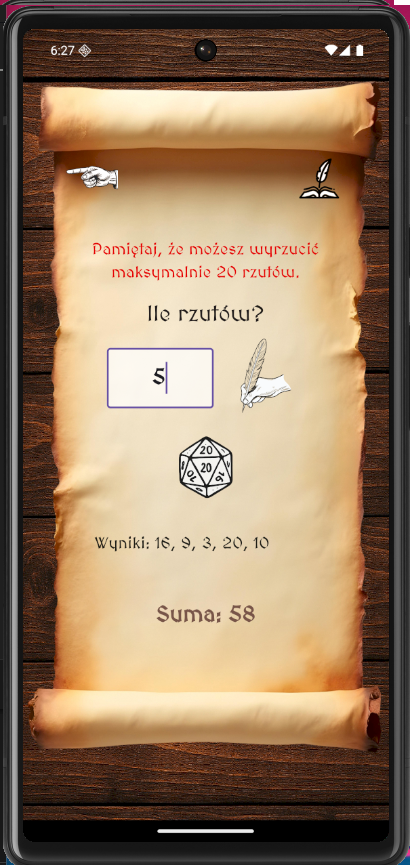
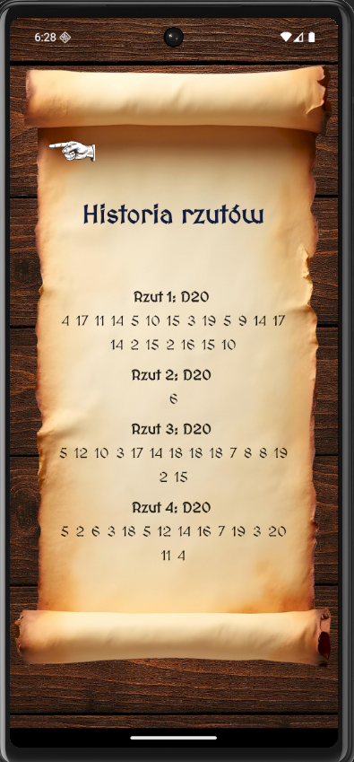

# DnDice RPG Roller

**DnDice RPG Roller** to narzędzie stworzone z myślą o graczach RPG, którzy potrzebują szybkiego i estetycznego sposobu na rzucanie kośćmi podczas sesji

---

## 🔧 Funkcje

- Możliwość rzucania wszystkimi typami kości  
- Podsumowanie wyników (pojedyncze rzuty i suma)  
- Przejrzysty, stylizowany interfejs z motywem fantasy
- Historia rzutów
- Animacja rzutu
- Splash screen
- Stylizowane UI fantasy
- Portretowy tryb
- Ikona aplikacji

---

## 📸 Screenshoty

### Ekran główny (Home Page)


### Ekran rzutu kością (Roll Dice Page)


### Ekran historii rzutów (Roll History Page)

---

## 🧰 Technologie

- Flutter  
- Dart  

---

## 🚀 Instalacja

1. Sklonuj repozytorium:

   ```bash
   git clone https://github.com/michaltrzepizur/DnDice_RPG_Roller.git

👤 Autor
Michał Trzepizur
GitHub
