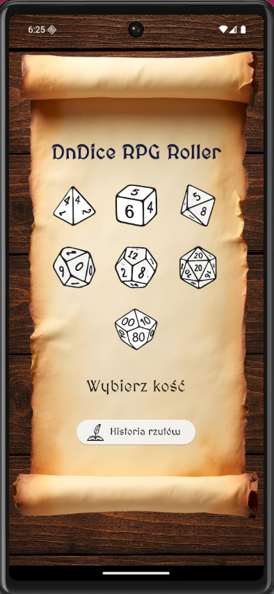
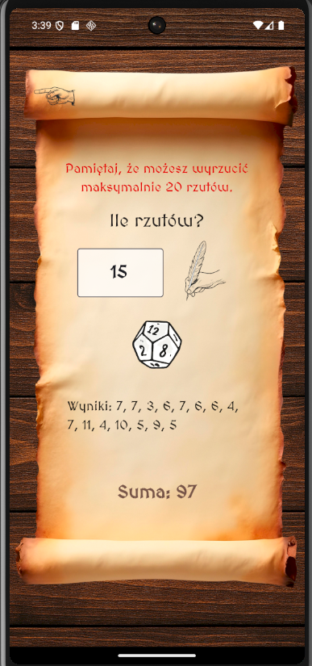

# DnDice RPG Roller

**DnDice RPG Roller** to aplikacja mobilna stworzona w Flutterze, która umożliwia szybkie i wygodne rzucanie kośćmi RPG (m.in. d4, d6, d8, d10, d12, d20, d100)

---

## 📸 Screenshoty

### Ekran główny (Home Page)


### Ekran rzutu kością (Roll Dice Page)


---

## 🔧 Funkcje

- Możliwość rzucania wszystkimi typami kości  
- Podsumowanie wyników (pojedyncze rzuty i suma)  
- Przejrzysty, stylizowany interfejs z motywem fantasy  

---

## 🧰 Technologie

- Flutter  
- Dart  

---

## 🚀 Instalacja

1. Sklonuj repozytorium:

   ```bash
   git clone https://github.com/michaltrzepizur/DnDice_RPG_Roller.git
